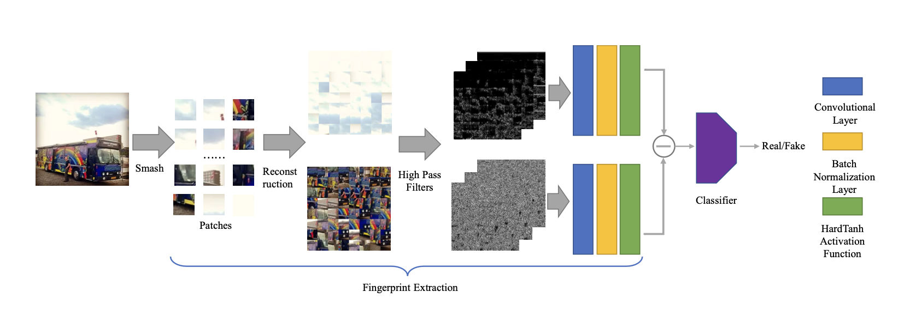

# Patch-based Texture Contrast for AI-Generated Image Detection

PDF file with explanation: `explanation.pdf`

## Model Baseline 



## Requirements

- matplotlib==3.7.1
- numpy==1.24.3
- Pillow==9.4.0
- torch==1.12.0
- torchvision==0.13.0
- tqdm==4.65.0

Run 
```bash
conda env create -f environment.yaml
```

## Training
```bash
python train.py 
```


